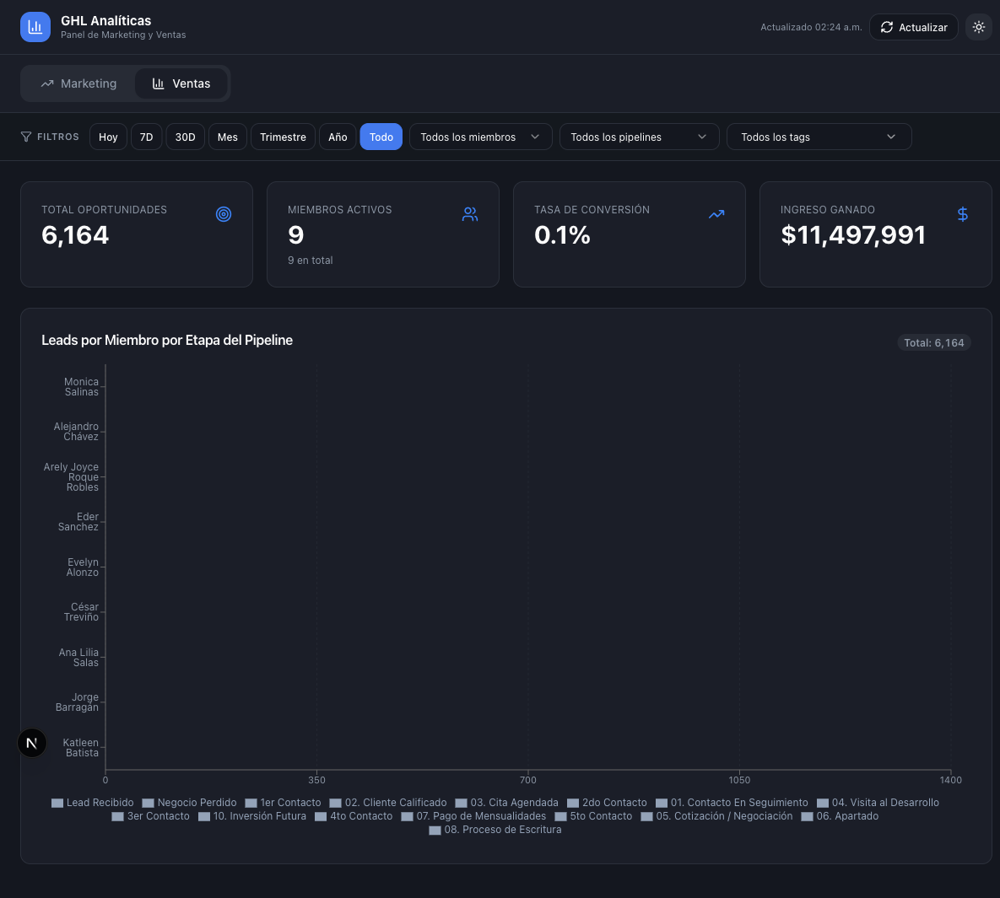

# GHL Analíticas

A real-time sales and marketing intelligence dashboard built on top of the [GoHighLevel](https://www.gohighlevel.com/) CRM API. Designed for real estate teams — gives managers a clear picture of what every salesperson is doing without digging through the CRM.



---

## What it does

Pulls live data from your GoHighLevel account and surfaces it in three views:

**Marketing** — Lead volume by source, campaign performance, pipeline stage distribution, and ad-type breakdown. Useful for understanding where leads come from and which campaigns convert.

**Ventas (Sales)** — Manager-focused view of individual rep performance:
- KPI strip: total opportunities, active members, conversion rate, won revenue
- Leads per rep broken down by pipeline stage
- Win/loss ratio per rep with win-rate annotations
- Won revenue per rep, sorted by top earner
- Open pipeline value by stage (how much money is sitting in Discovery vs. Proposal vs. Negotiation)
- New opportunities over time (weekly or monthly, auto-selected by date range)
- Lost reasons by rep — who is losing deals and why

**Conversaciones** — On-demand conversation history per contact, with pagination and CSV export.

All views share a filter bar: date range presets (Hoy / 7D / 30D / Mes / Trimestre / Año / Todo), member, pipeline, and tag filters. Filtering is instant and client-side.

---

## Tech stack

| Layer | Technology |
|---|---|
| Framework | Next.js 15 (App Router) |
| Language | TypeScript 5.7 |
| UI Components | shadcn/ui + Radix UI |
| Charts | Recharts 2.15 |
| Styling | Tailwind CSS v3 |
| Data fetching | SWR (60 s dedup, streaming NDJSON from API route) |
| Theming | next-themes (dark / light toggle) |
| CRM | GoHighLevel REST API v2021-07-28 / 2023-02-21 |

---

## Getting started

### Prerequisites

- Node.js 18+
- A GoHighLevel account with a **Private Integration** token
- The location/sub-account ID you want to monitor

### 1. Clone and install

```bash
git clone <repo-url>
cd <repo-folder>
npm install
```

### 2. Configure environment

Create `.env.local` in the project root:

```env
GHL_API_TOKEN=your_private_integration_token_here
GHL_LOCATION_ID=your_location_id_here
```

Both values are read exclusively server-side — they never reach the browser.

### 3. Run

```bash
npm run dev
```

Open [http://localhost:3000](http://localhost:3000).

---

## How data flows

```
GoHighLevel REST API  (server-side only)
        ↓
app/api/dashboard/route.ts
  • Fetches contacts, opportunities, pipelines, users, lost reasons in parallel
  • Resolves IDs → human-readable names (pipeline stages, user names, lost reasons)
  • Streams progress updates + final payload as NDJSON
        ↓
hooks/use-dashboard-data.ts  (SWR, 60 s dedup)
        ↓
components/dashboard/dashboard-app.tsx  (tab state, filter state, client-side filtering)
        ↓
components/dashboard/{marketing,sales,conversations}-dashboard.tsx
```

If the API is unavailable or returns an error, the UI transparently falls back to realistic mock data so the dashboard always shows something useful.

---

## Project structure

```
app/
  page.tsx                     # Root page: tabs, filters, data orchestration
  api/dashboard/route.ts       # GHL fetch + transform + NDJSON stream
components/
  dashboard/
    marketing-dashboard.tsx    # Marketing tab charts
    sales-dashboard.tsx        # Sales tab charts
    conversations-dashboard.tsx# Conversations tab
    filter-bar.tsx             # Shared filter bar + Filters interface
  ui/                          # shadcn/ui generated components
lib/
  ghl-client.ts                # GHL API fetch helpers (server-only)
  types.ts                     # Internal type system
  mock-data.ts                 # Fallback data for offline/dev use
  filter-helpers.ts            # Client-side filter logic
hooks/
  use-dashboard-data.ts        # SWR hook with streaming support
```

---

## Environment variables

| Variable | Description |
|---|---|
| `GHL_API_TOKEN` | GoHighLevel Private Integration bearer token |
| `GHL_LOCATION_ID` | GHL location (sub-account) ID to query |

---

## Available commands

```bash
npm run dev      # Start dev server at localhost:3000
npm run build    # Production build
npm run start    # Serve production build
npm run lint     # Run ESLint
```

---

## Notes

- **Calls and tasks** are always empty in live data — the GHL public API doesn't expose a calls endpoint, and tasks require per-contact fetches that don't scale. The mock data includes realistic examples for UI development.
- **Date filtering** is client-side. The GHL opportunity and contact endpoints don't uniformly support date range params, so data is filtered after fetching.
- **Lost reasons** are resolved from IDs to labels automatically via the `/custom-values` endpoint.
- The UI is in **Spanish** — designed for a Mexican real estate team.
